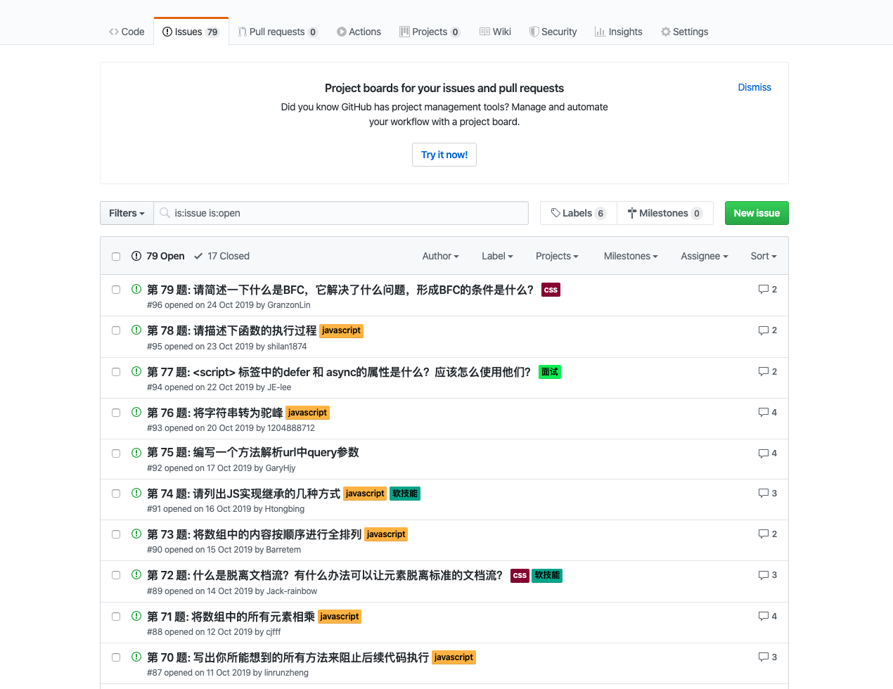
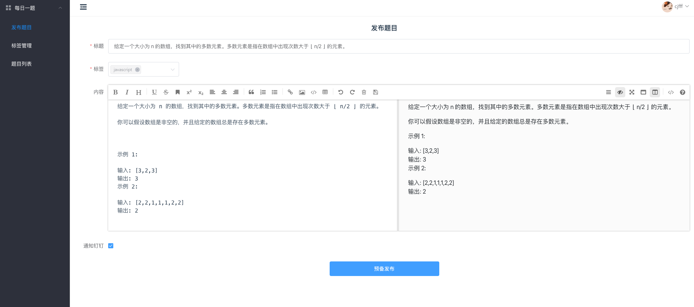
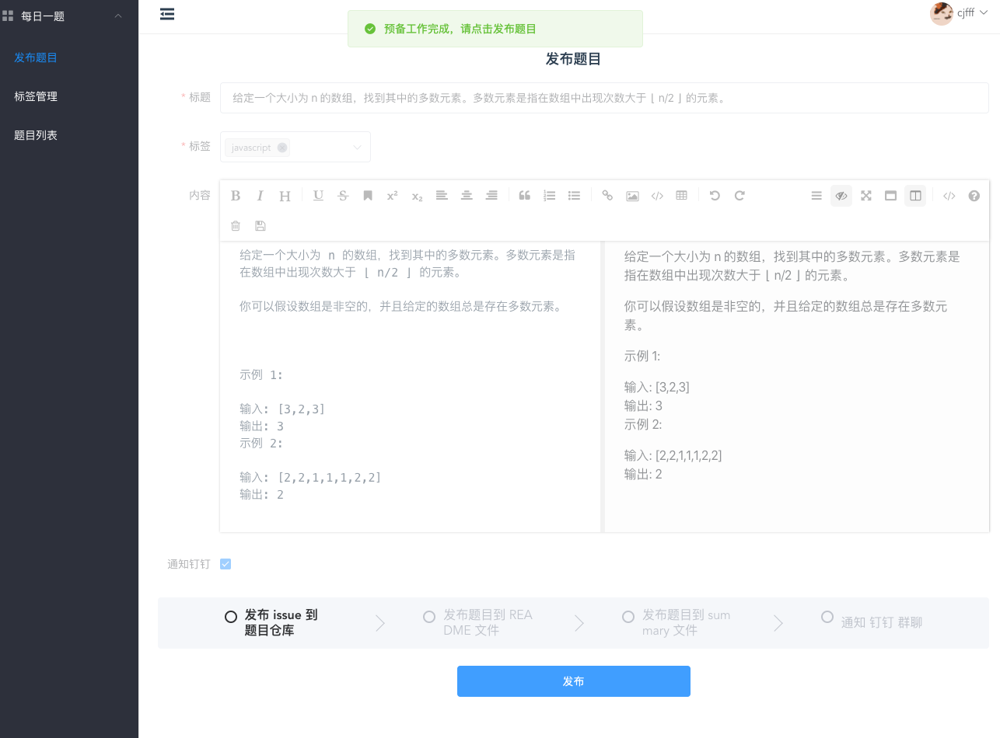
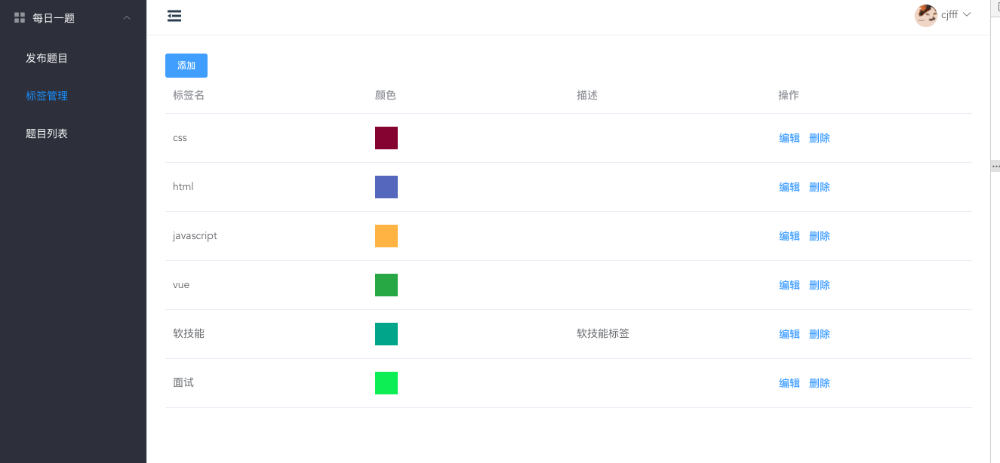
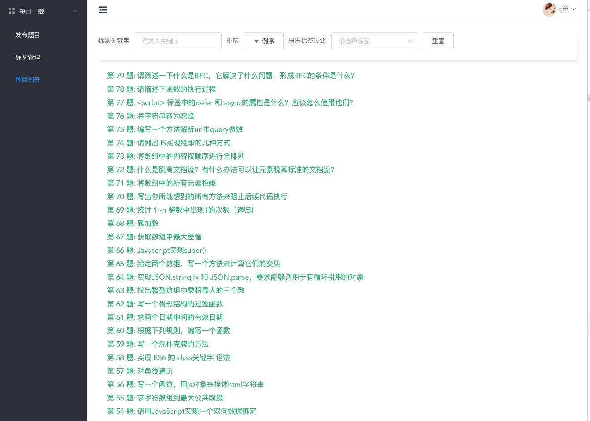

## 说明

本仓库为配套的每日一题系统的发题系统，如果需要的话，可以参照教程去进行部署，为你的团队增添一份活力。

这是团队中运行的例子 https://github.com/spaasteam/spaas-daily-practice/issues




## 功能预览

发题预备


预备发布


标签管理



题目详情


## 如何运行

```js
git clone https://github.com/cjfff/daliy-publish-system.git 或者 flok 此仓库到你自己的仓库


cd daliy-publish-system && yarn 


yarn serve // 启动
```


## 部署教程
https://www.yuque.com/ubdme4/ccc/efcfae


登录需要用到 github token
